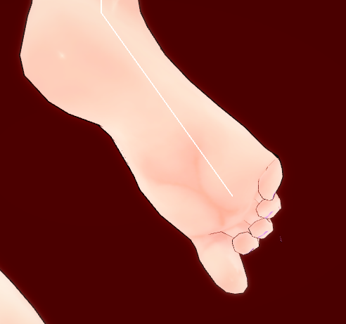

# KK_toesControl-solesTexture
Koikatu/Koikatsu mod
# Preview

# Install Mod
1. You need install BepInEx first.
2. Put the files into /mods.
3. This mod may not work with some mods, e.g. Uncensord mods.
# Update
## 1.20
Fix some details problem
# Download
[Download](https://github.com/mango123321a/KK_toesControl-solesTexture/releases/download/1.20/toesControl+solesTexture.zip)

**Password:** ZODGAME

# Finally
Thanks for the discord servers guys' help.
specially,
- [enimaroah](https://github.com/enimaroah)
- [Bepis](https://github.com/bbepis)
